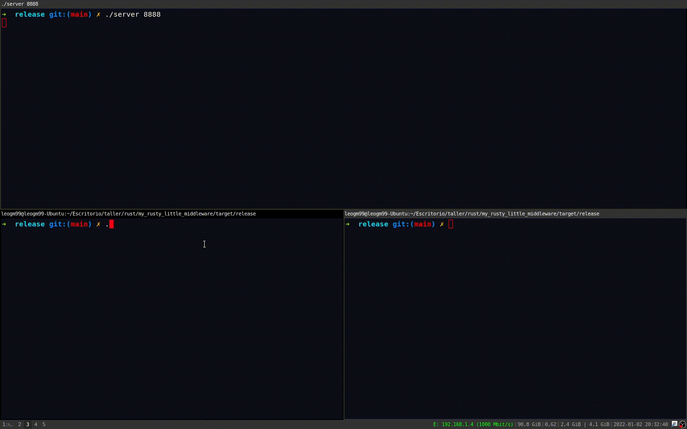

# my_rusty_little_middleware

Proyecto para practicar Rust, basado en un trabajo practico para la asignatura Taller de Programación I (Veiga - FIUBA). El trabajo original se planteó para ser desarrollado en C++. Se construyó un emulador de un MOM (Message Oriented Middleware) con funcionalidad básica, en donde diferentes clientes intercambian información a través de colas de datos que almacena el servidor. Los clientes pueden crear colas, pushear y poppear datos de las mismas.

Se utilizaron primitivas básicas de sicronización de Rust (Mutex, Arc, Condition Variables), threads y sockets TCP en crudo.

## Como buildear
- `git clone https://github.com/leogm99/my_rusty_little_middleware.git && cd my_rusty_little_middleware && cargo b --release`

Obs: se necesita cargo (Rust!)

## Como correr
- `./server <PORT>` (corre por default en localhost)
- `./client <IP> <PORT>`

## Comandos

- `define <NOMBRE_COLA>` crea una cola de mensajes con el nombre `NOMBRE_COLA`.
- `push <MENSAJE> <NOMBRE_COLA>` guarda el mensaje `<MENSAJE>` en la cola `NOMBRE_COLA` si es que esta existe.
- `pop <NOMBRE_COLA>` devuelve el ultimo mensaje de la cola `NOMBRE_COLA`, si es que existe. Ademas, si no hay un mensaje en la cola, bloquea al cliente hasta que lo haya.
- `exit` corta la conexion del cliente al servidor.

## Ejemplo

